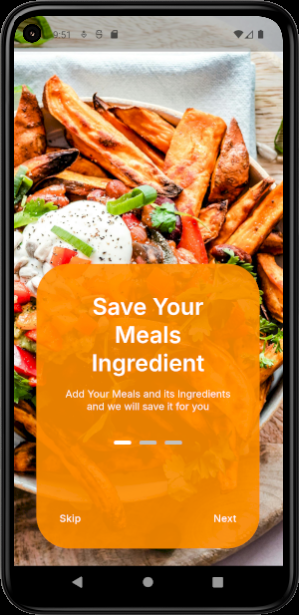
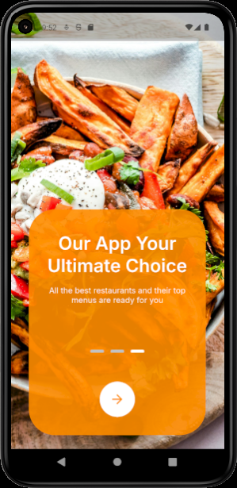
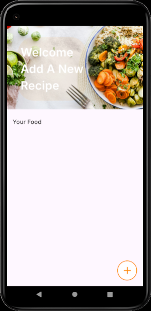
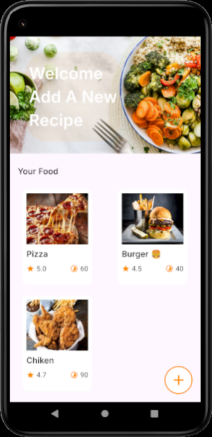
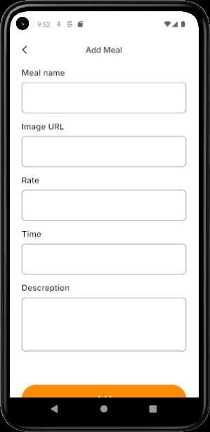
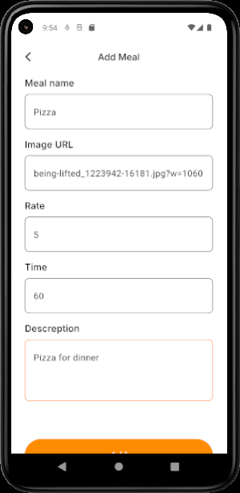
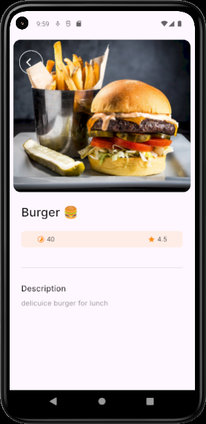

# Meals App 🍽️

A Flutter application that allows users to save and manage their favorite food recipes.
The app provides a simple and clean interface to add meals, view saved recipes, and explore meal details.

This project was built as part of a Flutter learning course and demonstrates working with local storage, navigation, and responsive UI design.

---

## 📱 Features

* **Onboarding Screen** – Introduces the app on first launch.
* **Home Screen** – Displays all saved meals.
* **Add Meal** – Users can add a new meal with details.
* **Meal Details Screen** – View full information about each meal.
* **Local Data Storage** – Meals are stored locally using SQLite.
* **Form Validation** – Ensures correct input before saving meals.
* **Persistent App State** – Onboarding is shown only on the first launch using SharedPreferences.

---

## 🛠 Tech Stack

* **Flutter**
* **SQLite** – Local database for storing meals
* **SharedPreferences** – For onboarding state persistence
* **GoRouter** – App navigation
* **Flutter ScreenUtil** – Responsive UI design
* **Carousel Slider** – Onboarding slider
* **Dots Indicator** – Onboarding page indicator
* **Feature-based Project Structure**

---

## 📸 Screenshots

### Onboarding 1


### Onboarding 2


### Home Screen 1


### Home Screen 2


### Add Meal 1


### Add Meal 2


### Details Screen 2


---

## 🚀 Getting Started

1. Clone the repository

```
git clone https://github.com/rimonnnn/meals-app-.git
```

2. Navigate to the project directory

```
cd meals-app-
```

3. Install dependencies

```
flutter pub get
```

4. Run the app

```
flutter run
```

---

## 📂 Project Structure

```
lib
│
├── core
│   ├── routing
│   ├── styles
│   ├── widgets
│
├── features
│   ├── onboarding
│   ├── home_screen
│   ├── add_meal
│   └── meal_details
│
└── main.dart
```

---

## 🎓 Project Type

This project was developed as a **course project** to practice Flutter development concepts including UI design, local storage, and navigation.

---

## 👨‍💻 Author

**Rimon**

Flutter Developer
